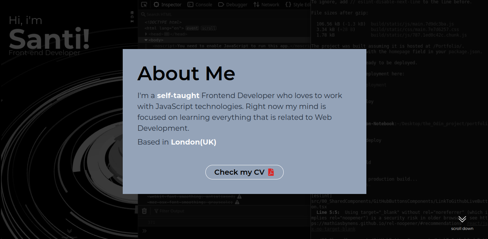

# Portfolio

This project was bootstrapped with [Create React App](https://github.com/facebook/create-react-app).

 

## Description
the basic layout is a React SPA with Typsecript that utilize useInView from framer-motion and scroll-snap CSS rules to give the feeling of multiple pages being loaded on scroll. Styled with TailwindCSS and VantaJs(the opening background animation showed on page 0).


Framer-motion is used to create a sliding animation that is started when useInView determines that the component is in the viewport. useInview is set to once:true which means that it will set itself to true on his first execution and  conditionally execute the animation once, to avoid the sliding to happen a second time when the user visit the component again. scroll-snap-y is the way the scrolling is handled, this way the user scrolling is forced to stop at every "page"  

  

## Project Structure

The project makes use of 4 different components which are rendered from App.jsx:
 - PresentationPage - behaves as the front cover of the project, like a presentation card
 - About me - as for the title, render information on me
 - ProjectModule - reusable, gets a props object with all the information on the projects and its rendered on screen
 - ContactPage - render the contact information, as well as the information about the Portfolio, github page and devicons
 
 
 
 ### ProjectModuleList
 makes use of the service component "ProjectModuleDataPackage" where all the typescript interfaces are saved as well as the data for each project page and an array that contains them. This contains the name of the project, the description text with the JSX.Element type (so that it can be customised) the href for the githib button, the src for the images, and the information to show the devicons and dependencies (boolean and string). 
 The ProjectModules are rendered on screen from ProjectModuleList by applying a .map() to the projectArray: iData[] that consumes the data for each project and returns a JSX.Element[].
 
 ## How to run the code
 
 ```bash
gh repo clone snt85c/Portfolio
```

install project repositories 

 ```bash
npm install
```

run

```bash
npm start
```

open http://localhost/3000 with your browser to see the site

## License

[MIT](https://choosealicense.com/licenses/mit/)
